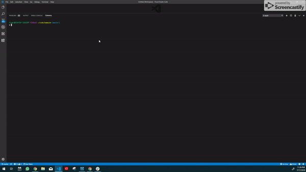

# Bamazon
---------------
## Table of Contents
1. [Abstract](#abstract)
2. [Coding Overview](#overview)
3. [Application Display](#display)

## Abstract
Bamazon is an Amazon-like storefront application that built with MySQL and Node.js. The app takes in orders from customers and deplete stock from the store inventory. It also tracks the product sales across the store's departments and provides a summary of the highest-grossing departments in the store.

There are three commands: 
1. `node bamazonCustomer`
* Customers can see the product list at first
* They can enter the product id which they would like to buy
* And enter the quantity of product that they would like to buy
* Application checks whether there are sufficient amount
    * If there is purchase goes through, app displays item in stock and prompt the purchase total. Once customer approve the amount then app updates the remaining products
    * If there is not app displays how many there is in the stock and ask customer to enter the amount accordingly to the stock

2. `node bamazonManager`
* App displays five choices that manager can choose
* The first choice is  `View Products for Sale`
    * Once managers select it they can see the list of products with remaining quantity and total sales of the products
* The second choice is `View Low Inventory`
    * App displays the product's quantity that belows five
* The third choice is ` Add to Inventory`  
    * App asks to manager item id and the quantity of item
    * Once manager enters the required fields app autometically updates the inventory and displays it
* The fourth choice is  `  Add New Product` 
    * App prompts item name, item price, item quantity
    * Once manager enters the required fields app autometically updates the inventory and displays it
* The last choice is ` Exit`
    * Manager can exit from the app using this choice

3. `node bamazonSupervisor`
* App displays three choices that supervisor can choose
* The first choice is `View Product Sales by Department`
    * App shows department name, overhead cost of department, total sales of department, and total profit of department
* The second choice is `Create New Department`
    * App asks the department name and overhead cost of department
    * Once supervisor enters the required fields new department is added to the database
    * If inventory has a product that is in the recently added department then app shows the new department on the product sales list
    * Otherwise recently added department stays on the database

## Coding Overview

The application is built with;

* JavaScript
* MySQL / SQL
* Node.js
* npm packages

## Application Display

### `node bamazonCustomer`

 
 

### `node bamazonManager`

 
 

### `node bamazonSupervisor`
